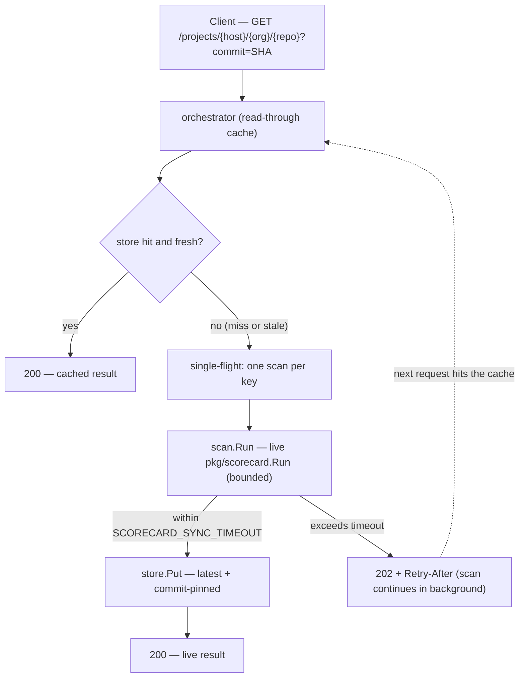
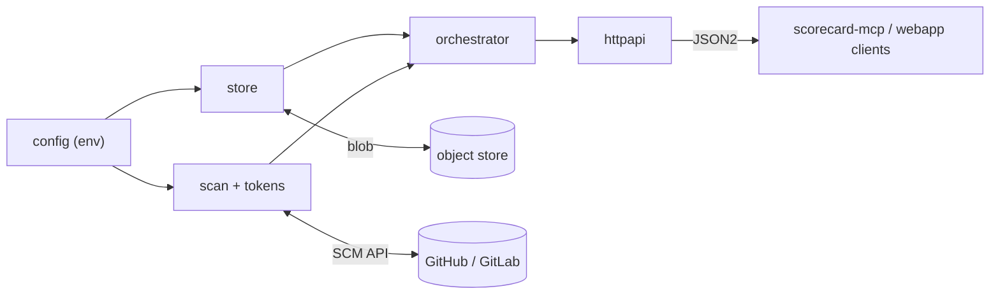

<!--
Copyright 2026 The uwu-tools Authors.
SPDX-License-Identifier: Apache-2.0
-->

# scorecard-api

[](LICENSE)
[](go.mod)

A cloud-agnostic, self-hosted [OpenSSF Scorecard](https://github.com/ossf/scorecard)
results **API server**. It serves pre-computed Scorecard results from any object
store and **generates them live on demand** when the cache misses — a read-through
cache over an in-process scan engine ("hybrid").

It speaks the [`ossf/scorecard-webapp`](https://github.com/ossf/scorecard-webapp)
GET contract, so it is a drop-in `--base-url` target for
[`uwu-tools/scorecard-mcp`](https://github.com/uwu-tools/scorecard-mcp) and any
client of the public `api.scorecard.dev`.

> **Scorecard results are heuristic signals, not a verdict.** This server never
> asserts that a repository "is secure" or "is insecure"; every response declares
> its source, freshness, and completeness. A score of `-1` means *inconclusive*,
> not failing. See [`/capabilities`](#get-capabilities).

## Contents

- [About](#about)
- [How it works](#how-it-works)
- [Components](#components)
- [Getting started](#getting-started)
  - [Prerequisites](#prerequisites)
  - [Installation](#installation)
- [Usage](#usage)
  - [Run the server](#run-the-server)
  - [Endpoints](#endpoints)
  - [Provenance headers](#provenance-headers)
  - [`GET /capabilities`](#get-capabilities)
  - [Storage backends](#storage-backends)
  - [Configuration](#configuration)
  - [As a `scorecard-mcp` backend](#as-a-scorecard-mcp-backend)
  - [Verifying end to end](#verifying-end-to-end)
- [Development](#development)
- [Roadmap](#roadmap)
- [Community](#community)
- [License](#license)

## About

The public Scorecard API only covers repositories that opted in via
`publish_results: true`, and its production stack is wedded to Google Cloud. Teams
that want results for **private** repos, for repos **not** in the weekly public
scan, or on **non-GCP** infrastructure have no first-class option. This server
fills that gap: it serves the same contract from **any** object store and computes
results on demand.

## How it works

Every request flows through a single **read-through cache** (the orchestrator),
which decides serve-vs-scan:



- **Freshness:** commit-pinned results (`?commit=SHA`) are immutable and cached
  forever; `latest` results carry a TTL and are refreshed on expiry.
- **De-duplication:** concurrent requests for the same key coalesce into exactly
  one scan (single-flight), so a burst of clients can't trigger redundant scans
  or exhaust SCM rate limits.
- **Persistence:** a live scan writes both the `latest` pointer and the
  commit-pinned object, so results are immediately reusable by this server, the
  public webapp, and `scorecard-mcp`.

## Components

The binary wires seven focused packages: `config → store + scanner →
orchestrator → HTTP`.



The `model` package (JSON2 + provenance + repo-ref parsing) is shared across all
of these.

| Component | Path | Responsibility |
| --- | --- | --- |
| **Binary** | `cmd/scorecard-api` | Loads config, wires the store, scanner, and orchestrator, and serves the HTTP API with graceful shutdown. |
| **model** | `internal/model` | Lean mirror of Scorecard **JSON2** plus provenance and `platform/owner/repo` parsing (default `github.com`; also `gitlab.com`; 40-hex commits). |
| **store** | `internal/store` | Object storage over [`gocloud.dev/blob`](https://gocloud.dev/); backend chosen by URL; implements the `{host}/{org}/{repo}[/{commit}]/results.json` key contract. |
| **scan** | `internal/scan` | The live engine: wraps `pkg/scorecard.Run`, reuses the OSS-Fuzz/CII/vulnerability clients across scans, and formats results to JSON2. |
| **tokens** | `internal/tokens` | SCM token pool (feeds Scorecard's `GITHUB_AUTH_TOKEN` rotation), per-host rate limiter, and bounded-concurrency worker pool with backoff. |
| **orchestrator** | `internal/orchestrator` | The read-through cache: freshness/TTL policy, single-flight de-duplication, and the sync-vs-async (`200`/`202`) decision. |
| **httpapi** | `internal/httpapi` | The webapp GET contract (`/projects`, `/badge`), plus `/capabilities`, `/health`, `/readyz`, and error mapping. |
| **config** | `internal/config` | 12-factor environment configuration with fail-fast validation. |

This is an **incubator, not a permanent fork**. The durable pieces are structured
to graft upstream over time — the contract + blob read path into
`ossf/scorecard-webapp`, and the live scan + HTTP surface into `ossf/scorecard`'s
`scorecard serve`. See [`docs/upstream-graft.md`](docs/upstream-graft.md) for the
per-component graft map and the `scorecard serve` reconciliation status.

## Getting started

### Prerequisites

- **Go** matching [`go.mod`](go.mod) (1.25.x).
- An **object store** reachable by a `gocloud.dev/blob` URL — a local directory
  (`file://…`) is enough to start; see [Storage backends](#storage-backends).
- For **live scans only**: network egress (the engine calls the SCM API and
  Scorecard's auxiliary data sources) and an **SCM token** (`GITHUB_AUTH_TOKEN`).
  Serving already-cached results needs neither.

### Installation

Build from source:

```sh
git clone https://github.com/uwu-tools/scorecard-api
cd scorecard-api
go build -o scorecard-api ./cmd/scorecard-api
```

Or, once a version is tagged, install the binary directly:

```sh
go install github.com/uwu-tools/scorecard-api/cmd/scorecard-api@latest
```

## Usage

### Run the server

```sh
export SCORECARD_RESULTS_BUCKET_URL="file:///tmp/scorecard"   # required
export GITHUB_AUTH_TOKEN="ghp_..."                            # only for live scans
./scorecard-api
```

The server logs its listen address (default `:8080`) and the resolved bucket URL,
then serves until it receives `SIGINT`/`SIGTERM`.

### Endpoints

| Method & path | Returns |
| --- | --- |
| `GET /projects/{host}/{org}/{repo}` | Latest result as canonical Scorecard **JSON2** |
| `GET /projects/{host}/{org}/{repo}?commit={sha}` | The immutable result for a 40-hex commit |
| `GET /projects/{host}/{org}/{repo}/badge` | SVG badge for the aggregate score |
| `GET /capabilities` | This server's mode, coverage, freshness policy, and caveats |
| `GET /health` | Liveness (always `200` while serving) |
| `GET /readyz` | Readiness (`503` until dependencies are usable) |

`host` includes the TLD (e.g. `github.com`). `github.com` and `gitlab.com` are
supported.

```sh
# Latest (cache HIT if present, else a live scan populates the cache)
curl -s http://localhost:8080/projects/github.com/ossf/scorecard | jq .score

# A specific, immutable commit
curl -s "http://localhost:8080/projects/github.com/ossf/scorecard?commit=<40-hex-sha>"

# Badge, capabilities, health
curl -s  http://localhost:8080/projects/github.com/ossf/scorecard/badge
curl -s  http://localhost:8080/capabilities | jq .
curl -sI http://localhost:8080/health
```

On a cache miss the server attempts a synchronous scan within
`SCORECARD_SYNC_TIMEOUT`. If it finishes in time you get `200` with the result;
otherwise you get `202 Accepted` with a `Retry-After` header while the scan
continues in the background and populates the cache for your next request.
Malformed refs return `400`, unreachable/blocked repos `404`, and scan failures
`502`.

### Provenance headers

Result bodies are canonical JSON2, served verbatim so webapp-compatible clients
parse them unchanged. Provenance is carried in response headers instead:

| Header | Meaning |
| --- | --- |
| `X-Scorecard-Source` | `cached` or `live` |
| `X-Scorecard-Resolved-Commit` | The commit the result was computed at |
| `X-Scorecard-Generated-At` | Result generation date (RFC 3339) |
| `X-Scorecard-Version` | Scorecard engine version |
| `X-Scorecard-Complete` | Whether every check produced a conclusive score |

### `GET /capabilities`

Exists so clients report provenance from the server instead of assuming
public-cache behavior:

```json
{
  "mode": "cached+live",
  "checks": "all",
  "requires_opt_in": false,
  "latest_ttl_seconds": 86400,
  "caveats": [
    "Scorecard results are heuristic signals, not a verdict; a repository is never labeled secure or insecure.",
    "A score of -1 is inconclusive, not a failing score.",
    "Results are generated on demand for any repository the configured token can access; no publish_results opt-in is required.",
    "Latest results are cached with a TTL and refreshed on expiry; pin a commit for an immutable result."
  ]
}
```

### Storage backends

Results are persisted through [`gocloud.dev/blob`](https://gocloud.dev/), so the
backend is selected entirely by a URL — nothing cloud-specific is compiled in.
Credentials resolve via each backend's default chain.

| Backend | `SCORECARD_RESULTS_BUCKET_URL` example |
| --- | --- |
| Local filesystem | `file:///var/lib/scorecard` |
| S3-compatible (AWS S3, self-hosted, etc.) | `s3://my-bucket?region=us-east-1&endpoint=localhost:9000&s3ForcePathStyle=true` |
| Azure Blob | `azblob://my-container` |
| Google Cloud Storage | `gs://my-bucket` |
| In-memory (tests only) | `mem://` |

For the local filesystem backend, the bucket directory is almost always a
separate mount from the process's own temp directory — a container volume, a
bind mount, or a Kubernetes PVC. `fileblob`'s default write path (temp file in
`os.TempDir()`, then rename into place) fails with `invalid cross-device link`
in that case, so this server always opens `file://` buckets with fileblob's
[`no_tmp_dir`](https://pkg.go.dev/gocloud.dev/blob/fileblob#URLOpener) option
forced on: the temp file is written next to the destination instead. You may
briefly see a `results.json.*.tmp` file next to a result during a write.

Object keys match `scorecard-webapp` exactly, so the same objects are servable by
the public webapp and readable by `scorecard-mcp`:

```text
{host}/{org}/{repo}/results.json            # latest (mutable, TTL)
{host}/{org}/{repo}/{commit}/results.json   # pinned (immutable)
```

### Configuration

All configuration comes from the environment. Only the bucket URL is required.

| Variable | Default | Description |
| --- | --- | --- |
| `SCORECARD_RESULTS_BUCKET_URL` | — (**required**) | `gocloud.dev/blob` URL of the result store |
| `SCORECARD_LISTEN_ADDR` | `:8080` | HTTP listen address (falls back to `:$PORT`) |
| `SCORECARD_LATEST_TTL` | `24h` | Freshness window for `latest` results |
| `SCORECARD_SYNC_TIMEOUT` | `20s` | How long a request waits before returning `202` |
| `SCORECARD_SCAN_TIMEOUT` | `5m` | Bound on a background scan |
| `SCORECARD_RETRY_AFTER` | `10s` | `Retry-After` hint on a `202` |
| `SCORECARD_SCAN_CONCURRENCY` | `4` | Max simultaneous live scans |
| `SCORECARD_ENABLED_CHECKS` | all | Comma-separated check names to restrict to |
| `SCORECARD_GITHUB_TOKENS` | — | Comma-separated SCM token pool (falls back to `GITHUB_AUTH_TOKEN`) |
| `SCORECARD_HOST_RATE_PER_SECOND` | `0` (unlimited) | Per-host scan rate limit |
| `SCORECARD_HOST_RATE_BURST` | `1` | Per-host rate burst |
| `SCORECARD_LOG_LEVEL` | `info` | `debug`, `info`, `warn`, or `error` |

Live scans call SCM and Scorecard's auxiliary data sources, so they need network
egress and an SCM token (`GITHUB_AUTH_TOKEN`, or `SCORECARD_GITHUB_TOKENS` which
is fed into Scorecard's token rotation). Serving already-cached results needs
neither.

### As a `scorecard-mcp` backend

[`scorecard-mcp`](https://github.com/uwu-tools/scorecard-mcp) is an MCP server
that reads Scorecard results. Point it at this server with `-base-url`, and its
`get_repo_score` / `get_check_result` tools resolve against your cache + live
scans instead of the public API:

```sh
scorecard-mcp -base-url http://localhost:8080
```

Configure it in an MCP host (Claude Desktop/Code, VS Code) the same way, setting
the base URL to your server. See the `scorecard-mcp` README for host wiring.

### Verifying end to end

[`docs/acceptance.md`](docs/acceptance.md) is a reproducible runbook that drives a
real `scorecard-mcp` binary against this server and checks both a cache **HIT** on
`fileblob` and a cache **MISS** that triggers a live scan, persists, and re-serves
from cache.

## Development

```sh
go build ./...
go test ./... -race
golangci-lint run ./...        # config in .golangci.yml (aligned with ossf/scorecard)
```

An S3-compatible integration test runs when `SCORECARD_TEST_S3_URL` is set (e.g. a
local self-hosted S3-compatible store), and is skipped otherwise.

### Running locally with Docker Compose

```sh
cp .env.example .env   # set GITHUB_AUTH_TOKEN for live scans
docker compose up --build
```

This builds the image and serves on `:8080`, persisting results to `./data` on
the host (via a bind mount) so they survive `docker compose down` and are
browsable directly — see [Storage backends](#storage-backends). The container
runs as a non-root user, so `./data` must be writable by it; if Compose
doesn't create it for you, `mkdir -p data && chmod 0777 data` first.

To exercise the S3-compatible code path instead of the default local
filesystem store, layer the S3 override, which also spins up a self-hosted
S3-compatible store and creates the bucket:

```sh
docker compose -f docker-compose.yml -f docker-compose.s3.yml up --build
```

This repository is developed spec-first with
[OpenSpec](https://github.com/Fission-AI/OpenSpec); see
[`CONTRIBUTING.md`](CONTRIBUTING.md), [`AGENTS.md`](AGENTS.md) for conventions,
and [`docs/bootstrap.md`](docs/bootstrap.md) plus the change under
[`openspec/`](openspec/) for the full design.

## Roadmap

Delivered in v0: the blob store (all drivers), the read-through cache
(single-flight + sync/async), the live scan engine, the token/rate manager, the
HTTP contract (`/projects`, `/badge`, `/capabilities`, `/health`, `/readyz`), and
acceptance against `scorecard-mcp` on `fileblob`.

Planned / deferred:

- S3-compatible leg of the smoke test in CI (the store already has a gated integration
  test).
- Teach `scorecard-mcp` to read `/capabilities` so it reports this server's
  provenance instead of the hardcoded public-cache caveats.
- A `gocloud.dev/pubsub` broker for multi-node scan fan-out.
- A warm-cache scheduler and an analytics/index layer.
- Signed-upload `POST` (Sigstore) and request-level auth / multi-tenancy.
- Grafting the durable pieces upstream (see
  [`docs/upstream-graft.md`](docs/upstream-graft.md)).

## Community

- [Code of Conduct](CODE_OF_CONDUCT.md)
- [Contributing](CONTRIBUTING.md)
- [Security Policy](SECURITY.md)
- [Support](SUPPORT.md)
- [Maintainers](MAINTAINERS.md)

## License

Apache 2.0 — see [`LICENSE`](LICENSE).

Data served from Scorecard is licensed under
[CDLA Permissive 2.0](https://github.com/ossf/scorecard#scorecard-rest-api).
